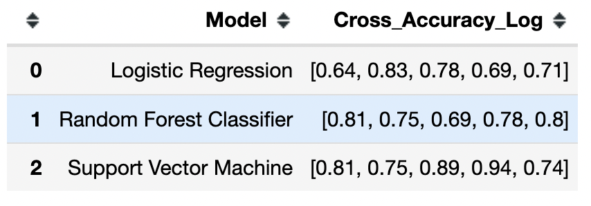

# Titanic Kaggle Submission 

Predict survival rates of passengers
(https://www.kaggle.com/karenbolon)

I was able to rank in the top 6% of the Kaggle Titanic Competition (872 out of 14,257 submissions)

**Business use:**  
A prediction model can help companies target specific clientele to help with cost savings. For example, pretend you are a Sporting Goods company and you are initiating a new marketing campaign to acquire new customers.  You would want to target specific sporty people to ensure a better conversion rate of new customers.  Your money would be better spent targeting people with similar likes than randomly selecting people.

# [Titanic Dataset: Supervised Machine Learning (Predicting Survival Rates)](https://github.com/kbolon1/Titanic_Dataset)

* Used python, pandas, seaborn, NymPy, matplotlib, sklearn
* Collected data from Kaggle (https://www.kaggle.com/c/titanic)
* Implemented and compared a variety of Machine Learning classifiers with scikit-learn (logistic regression, support vector machine, random forest) to predict survival of passengers on the Titanic

* Project consisted of all phases of Machine Learning work-flow: 
	- train-test-splitting of data, 
	- data exploration, 
	- feature engineering, 
	- optimization of hyperparameters, 
	- evaluation of models with cross-validation.
 
A correlation matrix: 
 	

With the above matrix, it is easy to see the features with the strongest positive correlations (orange) and the features with the strongest negative correlations (black).

I can conclude that there are strong positive correlations between SibSp (Siblings/Spouses) and Parch (Parents of Children)—and that makes sense because families often travel together. Pclass (Class) and Fare are strongly negatively correlated—that makes sense because 1st class tickets are more expensive than lower class tickets, meaning as class goes down (closer to 1 or first class) the fare goes up. Finally Age and Pclass (Class) are moderately negatively correlated since richer people are generally older.

**Conclusion:**
I really enjoyed this competition and exploring the data and models to see what worked and what didn't work. I am really proud of my ranking of 6% and hope I can score as high in future competitions.

